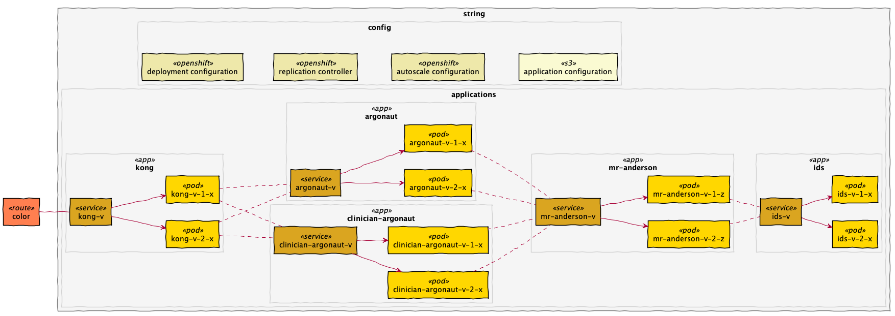
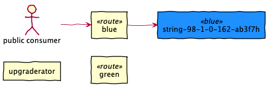
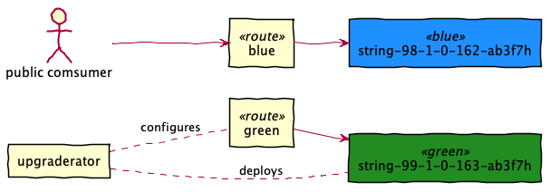
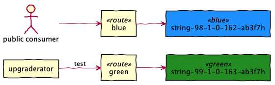
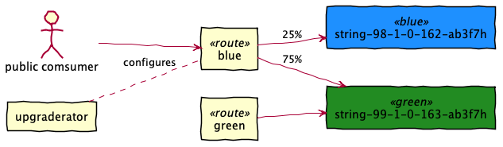
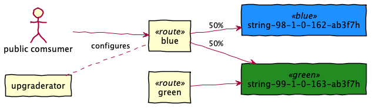

# health-apis-deployer

This project is the home for the 
[Health APIs](https://github.com/department-of-veterans-affairs/health-apis/) CD/CI pipeline.
This pipeline is used for automatic building, testing, and blue-green deployments.
Health APIs consists of the three applications, Argonaut, Mr. Anderson, and Identity Service.
This deployer will manage the configuration of OpenShift and applications.

##### Key Concepts
- This Jenkins job produces an _Upgraderator_ Docker image that contains everything it needs
  to deploy exactly one version of the Health API applications. This includes
  - Application version information
  - OpenShift configuration
  - Application configuration
  - Test suites
- Deployments are uniquely versioned
- Upgraderators include configuration for all environments (QA, Lab QA, Lab, and Prod) 
- Upgraderators are immutable and portable
- Upgraderators can remove the version they installed
- Zero downtime upgrades

##### Version Numbers
Deployments are uniquely numbered using
- The Jenkins the build number
- The Health APIs application version number
- The Git commit has of this repository (which includes configuration)

> For example `99_1_0_163-ab3f7h`, is Jenkins build number `99` for version `1.0.163` of the 
> Health APIs using configuration version `ab3f7h`.

##### Triggers
- a successful jenkins build of the health-apis project
- a manual launch of the deployer jenkins job

----

# Strings
A _string_ represents the complete set of artifacts deployed.

A string consists of
- OpenShift artifacts
  - Deployment configuration
  - Replication controller configuration
  - Horizontal autoscaler configuration
  - Service definitions
- Application docker images running as pods
- Externalized application configuration in S3 for environment-specific details, such as database
  credentials.

Every artifact in the string is uniquely versioned and may only interact with components in it's
string. 
For example, `argonaut-99-1-0-163-ab3f7h` may only communicate with `mr-anderson-99-1-0-163-ab3f7h`.
It cannot communicate with `mr-anderson-98-1-0-162-ab3f7h`. 

##### Routes
Routes live outside of a string, but are affected by deployments. A route represents the ingress 
points of the system. During deployments, routes are reconfigured to direct traffic to new 
deployments. 

----

# Blue-Green
Blue-green deployment is an technique for rolling out production upgrades designed to minimize 
downtime by creating two production environments, _blue_ and _green_. Blue is the currently live
environment that is servicing all traffic. Green is the next version or idle. Once the green 
version is validated, it will be live and public traffic will routed to it.

Consider the following the example. `98-1-0-162-ab3f7h` is blue and currently serving traffic.
We make a changes to the Health API applications, which will create version `1.0.163`. Jenkins
will combine this version with latest version of configuration `ab3f7h` and deploy it.

##### Starting state

- Public traffic is directed blue

##### Deploy green

- Public traffic is directed to blue
- Upgraderator 
  - deploys a green string
  - configures the green route to direct traffic to newly deployed green

##### Test green

- Public traffic is directed to blue
- Upgraderator tests green by making requests to the _internal_ green route, e.g 
  `green.argonaut.prod.lighthouse.va.gov`

##### Migrate traffic

- Over the course of an hour, all traffic is migrated from blue to green
  - 25% more traffic is directed to green every 15 minutes

##### Green to blue, blue to gray

- Once all traffic is migrated to green
  - Blue becomes _gray_ (it is running, but idle)
  - Green becomes _blue_ (it is now serving 100% of traffic) 

### Aborting a deployment
Should a problem be discovered during or after traffic migration, a system administrator can easily
restore previous functionality by performing the following steps:
1. Terminate the Jenkins job that orchestrating the transition, if still running
2. Re-configure the blue route to direct 100% traffic to the old blue version in OpenShift by 
   dragging the _Service Weight_ slider back to blue 

----

# What's in the box?

The gory details of the Upgraderator.

#### Entrypoints
- `upgraderator.sh` - Creates, tests, and transitions strings
- `deleterator.sh` - Removes a string

Bonus entrypoint
- `blue-green.sh` - Configure blue or green routes

#### Upgraderator configuration
- `version.conf`
- `build.conf`
- `qa.conf`

#### OpenShift configuration
- `deployment-configs/*-dc.yaml`
- `service-configs/*-sc.yaml`
- `autoscaling-configs/*-ac.yaml`
- `blue.json.template`
- `green.json.template`

#### Application configuration
- `application-properties/*.properties`
- `on-start.sh.template`

An _Upgraderator_ contains the following configurations and functionalities:

##### health-apis version number
...
##### health-apis application.properties
...
##### environment configurations
...
##### openshift deployment-configs
...
##### openshift service-configs
...
##### openshift autoscaling-configs
...
##### template files
...

Upgraderator containers also contains the following scripts that perform the legwork of the CD/CI process:

##### `upgraderator.sh`
...
##### `deleterator.sh`
...
##### `blue-green.sh`
...
